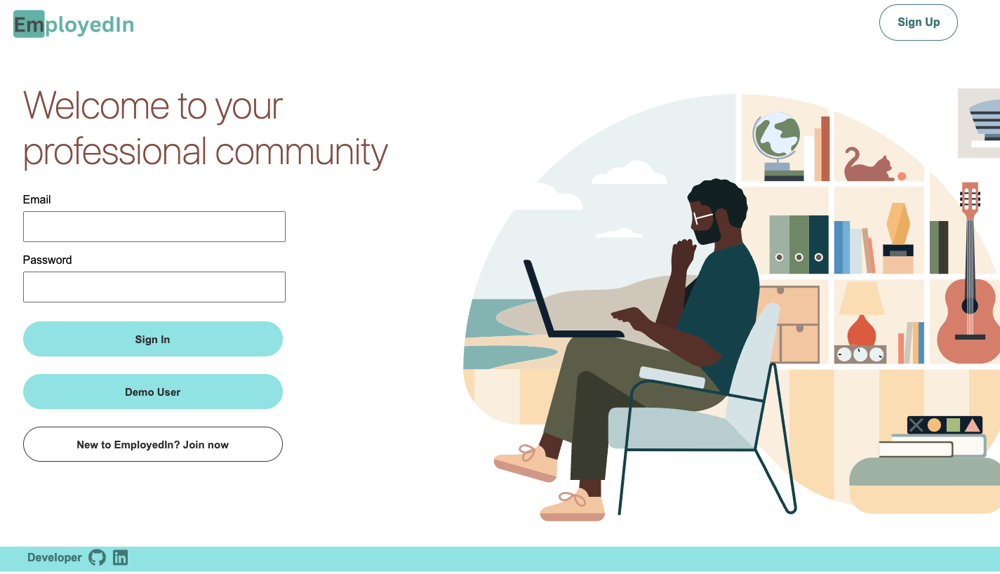
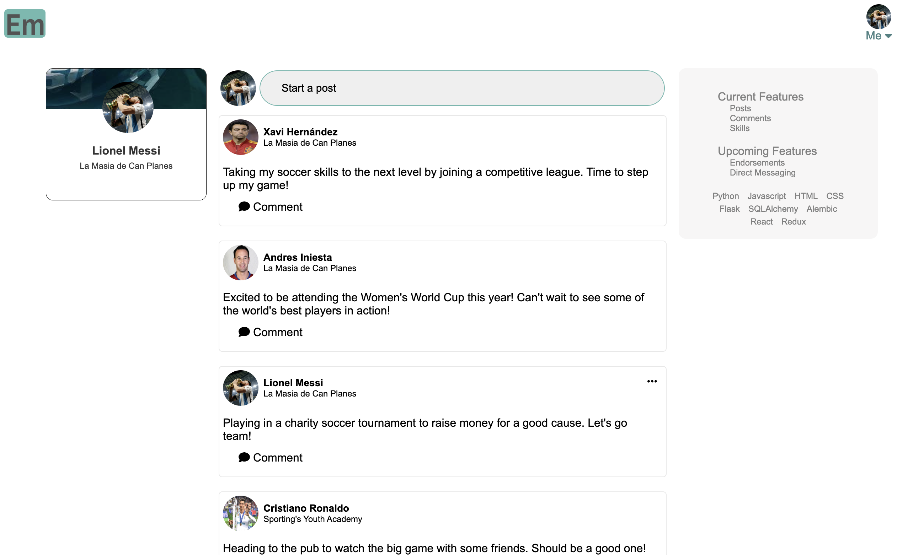
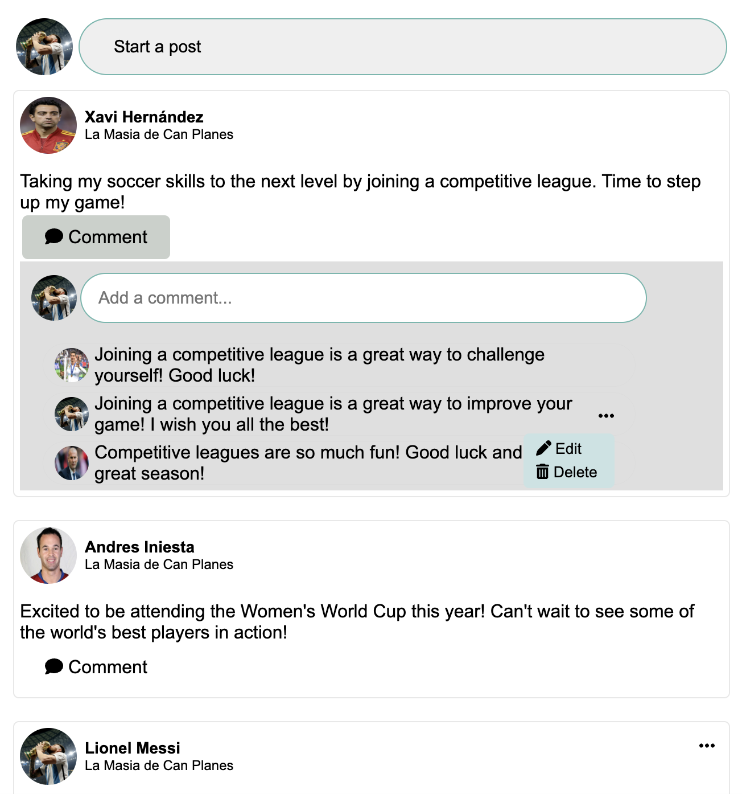
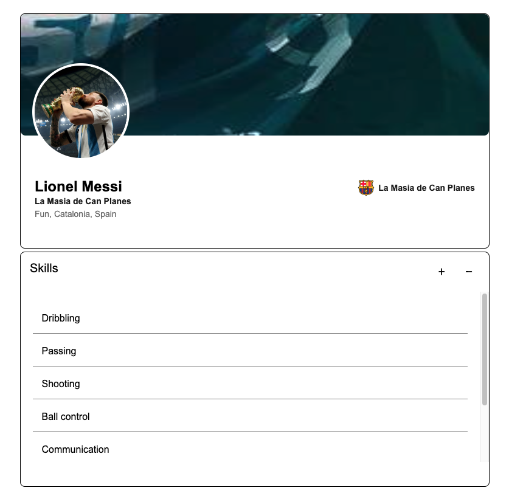

# EmployedIn

## About

[Employedin](https://employedin.onrender.com/) is a Full-Stack web application that was inspired by LinkedIn. It is a platform that allows users to create personal profile create posts and comments and also list their skills.

Project Link: https://employedin.onrender.com/

## Tech Stack

### Frontend:


### Backend:


### Languages:


## Features

### Splash Page



### Posts

Upon sign up, users can create their own post, edit and delete them.


### Comments

Users can leave comments on any post on EmployedIn and are able to edit and delete their own comments, via ellipse icon



### Skills
Users can add and remove skills to their personal profile.



## Future Implementations

### Endorsements

Users will be able to endorse other users' skills or remove endorsements

### Direct Messaging

Users will be able to send direct messages to other users

## Run Locally

## Getting started
1. Clone this repository:

   `
   https://github.com/yhtay/EmployedIn-Capstone.git
   `
2. Install denpendencies into the Backed and the Frontend by making a terminal for each one and then run the following:

   ```
   npm install
   ```

3. Create a **.env** file using the **.envexample** provided

4. Set up your database with information from your .env and then run the following to create your database, migrate, and seed:

   ```
   npx dotenv sequelize db:create &&
   npx dotenv sequelize db:migrate &&
   npx dotenv sequelize db:seed:all
   ```

5. Start the app for both backend and frontend using:

   ```
   npm start
   ```
   to run the frontend
   ```
   flask run
   ```
   to run the backend

6. Now you can use the Demo User or Create an account
